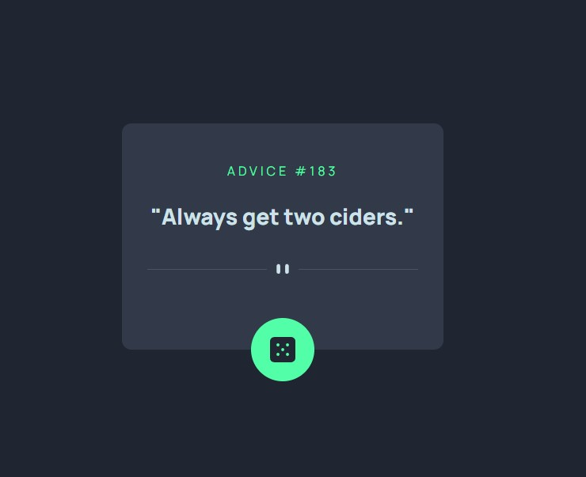

# Frontend Mentor - Advice generator app solution

This is a solution to the [Advice generator app challenge on Frontend Mentor](https://www.frontendmentor.io/challenges/advice-generator-app-QdUG-13db). Frontend Mentor challenges help you improve your coding skills by building realistic projects.

## Table of contents

- [Overview](#overview)
  - [The challenge](#the-challenge)
  - [Screenshot](#screenshot)
  - [Links](#links)
- [My process](#my-process)
  - [Built with](#built-with)
  - [What I learned](#what-i-learned)
  - [Useful resources](#useful-resources)
- [Author](#author)
- [Acknowledgments](#acknowledgments)

## Overview

### The challenge

Users should be able to:

- View the optimal layout for the app depending on their device's screen size
- See hover states for all interactive elements on the page
- Generate a new piece of advice by clicking the dice icon

### Screenshot

### Links

- Solution URL: [Frontend Mentor](https://www.frontendmentor.io/solutions/responsive-mobilefirst-with-vite-and-axios-r6LucXBMQJ)
- Live Site URL: [Render](https://advice-generator-mt67.onrender.com/)

## My process
After deleting the majority of the starter code from the generated vite project. I utilized react's builtin hooks to fetch and save the data

### Built with

- Semantic HTML5 markup
- CSS custom properties
- Flexbox
- CSS Grid
- Mobile-first workflow
- [React](https://reactjs.org/) - JS library
- [Vite](https://vitejs.dev/) - React framework
- [Axios](https://axios-http.com/) - HTTP client for nodejs

### What I learned
I learned how to use image sourcesets to define different sized image files for the same image tag.

### Useful resources

- [Img Srcset](https://stackoverflow.com/questions/30460681/changing-image-src-depending-on-screen-size) - I wasn't too sure on how to change the image source.  I tried setting a empty div's background to the image and attempted to use media queries to change the source but that didn't quite work out as I hoped.  So I found the answer on this post utilizing the srcset attribute of the image tag, which I had not known existed.  This solves the issue by allowing me to link multiple images and the intended screen size. 

## Author
- Website - [Sherline Au](https://sherlineau.com)
- Frontend Mentor - [@sherlineau](https://www.frontendmentor.io/profile/sherlineau)