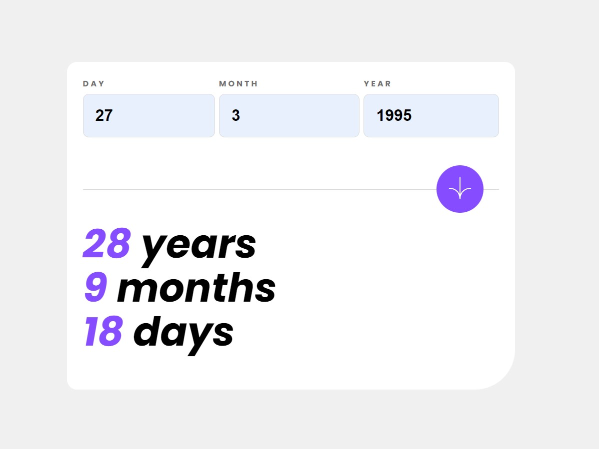

# Frontend Mentor - Age calculator app solution

This is a solution to the [Age calculator app challenge on Frontend Mentor](https://www.frontendmentor.io/challenges/age-calculator-app-dF9DFFpj-Q). Frontend Mentor challenges help you improve your coding skills by building realistic projects. 

## Table of contents

- [Overview](#overview)
  - [The challenge](#the-challenge)
  - [Screenshot](#screenshot)
  - [Links](#links)
- [My process](#my-process)
  - [Built with](#built-with)
  - [Useful resources](#useful-resources)
- [Author](#author)
- [Acknowledgments](#acknowledgments)

**Note: Delete this note and update the table of contents based on what sections you keep.**

## Overview

### The challenge

Users should be able to:

- View an age in years, months, and days after submitting a valid date through the form
- Receive validation errors if:
  - Any field is empty when the form is submitted
  - The day number is not between 1-31
  - The month number is not between 1-12
  - The year is in the future
  - The date is invalid e.g. 31/04/1991 (there are 30 days in April)
- View the optimal layout for the interface depending on their device's screen size
- See hover and focus states for all interactive elements on the page
- **Bonus**: See the age numbers animate to their final number when the form is submitted

### Screenshot

### Links
- Solution URL: [Frontend Mentor](https://www.frontendmentor.io/solutions/age-calculator-using-vite-4kKB_B5k3E)
- Live Site URL: [Render](https://age-calculator-3yf1.onrender.com)

## My process
I initiate the project  by setting up a basic layout using the design documentation. This includes a user input form and a section to display the results. Starting with the form, I use React's useState hook to grab and manage user input – it's key for my calculations. After successfully getting the input, I merge all the fields into a single date object and run some checks. Ran into a little hiccup where I couldn't validate individual fields, but I spotted that later on and fixed it. Going down my checklist of validations, I put together simple if statements for each error and toss them into an array for display later. Once all the validation checks are done, I create a quick algorithm to figure out the date difference from today, making sure to handle negative numbers.

### Built with
- Semantic HTML5 markup
- Flexbox
- CSS Grid
- Mobile-first workflow
- [React](https://reactjs.org/) - JS library
- [Vite](https://vitejs.dev/) - React framework

### Useful resources
- [mdn web docs - Date](https://developer.mozilla.org/en-US/docs/Web/JavaScript/Reference/Global_Objects/Date) - This was a helpful resource in figuring out how to utilize the built-in Date object.

## Author
- Website - [Sherline Au](https://sherlineau.com)
- Frontend Mentor - [@sherlineau](https://www.frontendmentor.io/profile/sherlineau)