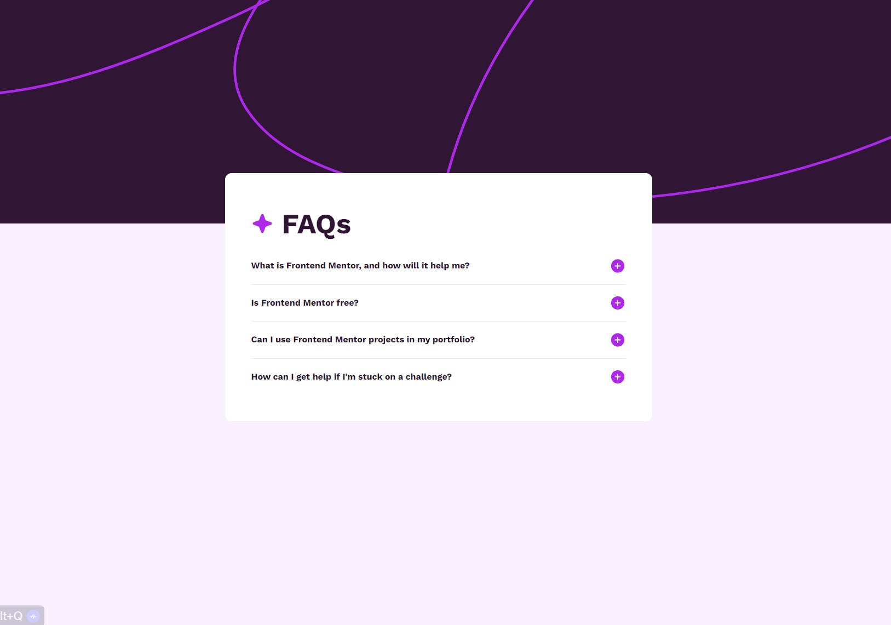

# Frontend Mentor - FAQ accordion solution

This is a solution to the [FAQ accordion challenge on Frontend Mentor](https://www.frontendmentor.io/challenges/faq-accordion-wyfFdeBwBz). Frontend Mentor challenges help you improve your coding skills by building realistic projects. 

## Table of contents

- [Overview](#overview)
  - [The challenge](#the-challenge)
  - [Screenshot](#screenshot)
  - [Links](#links)
  - [Built with](#built-with)
  - [What I learned](#what-i-learned)
  - [Continued development](#continued-development)
- [Author](#author)
- [Acknowledgments](#acknowledgments)

## Overview

### The challenge

Users should be able to:

- Hide/Show the answer to a question when the question is clicked
- Navigate the questions and hide/show answers using keyboard navigation alone
- View the optimal layout for the interface depending on their device's screen size
- See hover and focus states for all interactive elements on the page

### Screenshot

### Links

- Solution URL: [frontendmentor.io](https://www.frontendmentor.io/solutions/faq-accordion-using-vitejs-tKPwdHGwOv)
- Live Site URL: [render](https://fm-faqaccordian.onrender.com/)

### Built with

- Semantic HTML5 markup
- CSS custom properties
- Flexbox
- [React](https://reactjs.org/) - JS library
- [Vite](https://vitejs.dev/) - React framework

### Continued development

I would like to learn more about implementing keyboard navigation.  

## Author

- Website - [Sherline Au](https://sherlineau.com)
- Frontend Mentor - [@sherlineau](https://www.frontendmentor.io/profile/sherlineau)
