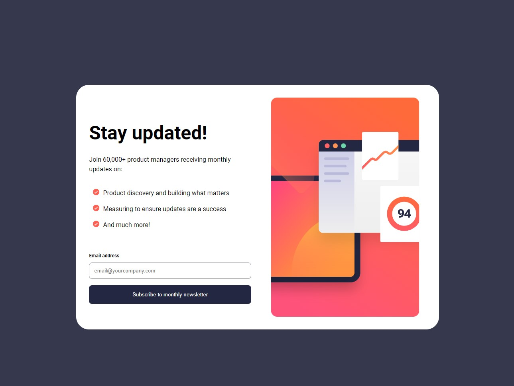

# Frontend Mentor - Newsletter sign-up form with success message solution

This is a solution to the [Newsletter sign-up form with success message challenge on Frontend Mentor](https://www.frontendmentor.io/challenges/newsletter-signup-form-with-success-message-3FC1AZbNrv). Frontend Mentor challenges help you improve your coding skills by building realistic projects. 

## Table of contents

- [Overview](#overview)
  - [The challenge](#the-challenge)
  - [Screenshot](#screenshot)
  - [Links](#links)
- [My process](#my-process)
  - [Built with](#built-with)
  - [What I learned](#what-i-learned)
  - [Continued development](#continued-development)
- [Author](#author)

## Overview

### The challenge

Users should be able to:

- Add their email and submit the form
- See a success message with their email after successfully submitting the form
- See form validation messages if:
  - The field is left empty
  - The email address is not formatted correctly
- View the optimal layout for the interface depending on their device's screen size
- See hover and focus states for all interactive elements on the page

### Screenshot

### Links

- Solution URL: [frontendmentor.io](https://www.frontendmentor.io/solutions/newsletter-signup-using-vite-and-desktopfirst-approach-sJzlmhE6Ch)
- Live Site URL: [Render](https://fm-newsletter.onrender.com/)

## My process

I started out with breaking down the main component, which is the newsletter with a form.  After building the basic blocks, I moved onto figuring out the logic behind validating the user's email input.  Based on the challenge, I needed to account for an empty input and an incorrectly formatted input.  Email's always follow the same format: text@website.domainsuffix.  Since the pattern will always be the same, I used a regular expression to compare the user's input through the component onChange hook. After figuring this out, everything else was simply putting together the remaining content and adjusting the css to match the style guide and design documents.  

### Built with

- Semantic HTML5 markup
- CSS custom properties
- Flexbox
- Desktop first workflow
- [React](https://reactjs.org/) - JS library
- [Vite](https://vitejs.dev/) - React framework

### What I learned

I learned how to change images based on the window size using react hooks.  I attempted to use media queries but it wouldn't quite work out since I was using an image tag, so I basically needed to change the source url within the component jsx. 

### Continued development

I'm not comfortable with mobile designs, so I would like to get in the habit of a mobile-first approach until I get comfortable with it.  

## Author

- Website - [Sherline Au](https://sherlineau.com)
- Frontend Mentor - [@sherlineau](https://www.frontendmentor.io/profile/sherlineau)