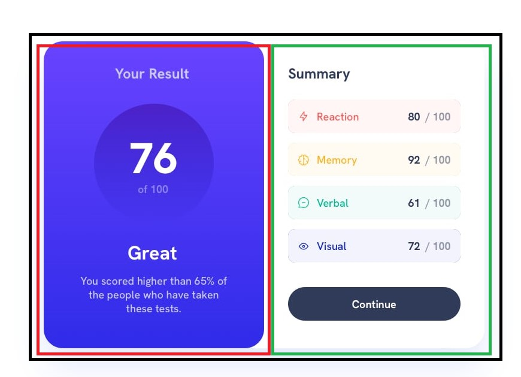

# Frontend Mentor - Results summary component solution

This is a solution to the [Results summary component challenge on Frontend Mentor](https://www.frontendmentor.io/challenges/results-summary-component-CE_K6s0maV). Frontend Mentor challenges help you improve your coding skills by building realistic projects.

## Table of contents

- [Overview](#overview)
  - [The challenge](#the-challenge)
  - [Screenshot](#screenshot)
  - [Links](#links)
- [My process](#my-process)
  - [Built with](#built-with)
  - [What I learned](#what-i-learned)
  - [Continued development](#continued-development)
  - [Useful resources](#useful-resources)
- [Author](#author)
- [Acknowledgments](#acknowledgments)

## Overview

### The challenge

Users should be able to:

- View the optimal layout for the interface depending on their device's screen size
- See hover and focus states for all interactive elements on the page
- **Bonus**: Use the local JSON data to dynamically populate the content

### Screenshot


### Links

- Solution URL: [GitHub](https://github.com/sherlineau/frontend-mentor/tree/results-summary/results-summary)
- Live Site URL: [Render](https://fm-results-summary.onrender.com/)

## My process

To begin, I read through the challenge and took note of the main components I wanted to include. Then I created a short todo list. I typically like to start out with bringing in the basic information. The bonus objective calls for dynaically populating the content via JSON. So my first step was importing the data into my vite project through json and displaying that on my application first. After importing the data, I wrote a short function to calculate the average of the combined categories.

Next, I worked on generating each category row. They have the same base, the only difference being the colors based on the category and score. These are all separated into different objects within the JSON file. I created a reusable component called categoryScore. While iterating through the imported data array, a categoryScore component was created and the corresponding object in the data array was transferred through the component props. The prop data is deconstructed within the component file for easier readability. With this completed, I have imported all the necessary data so all that needs to be done is styling.

I broke down the design file into separate sections. Looking for my building blocks.  I arranged all my content based on this. I mostly used flex for most of it. The tricky part was getting the different colors for the categories. To keep a consistent color scheme, I utilized variables.

### Built with

- Semantic HTML5 markup
- CSS custom properties
- Flexbox
- [React](https://reactjs.org/) - JS library
- [Vite](https://vitejs.dev/) - React framework

### What I learned

An interesting thing I learned with this project is being able to assigning just the numeric values to the variable. Instead of having --clr = rgb(1,1,1), I used --clr= 1,1,1. Which allows me to utilize different color versions. This was especially useful for the transparent backgrounds, since I wanted to use the same color with a different opacity. Incorporating it this way also allows for easier changes, I would only need to change the color on one line to change the text color and background of the specific category.

```html
<h1>Some HTML code I'm proud of</h1>
```

```css
#root {
  --clr-light-red: 0, 100%, 67%;
  --clr-orange-yellow: 39, 100%, 56%;
  --clr-green-teal: 166, 100%, 37%;
  --clr-colbalt-blue: 234, 85%, 45%;
}

.Reaction {
  background-color: hsla(var(--clr-light-red), 0.25);
  color: hsl(var(--clr-light-red));
}
```
### Continued development

I would like to optimize it for mobile devices.

### Useful resources
- [Importing JSON data into Vite](https://github.com/vitejs/vite/discussions/8242) - This thread taught me how to dynamically import data into a vite project using fetch.

## Author
- Website - [Sherline Au](https://www.sherlineau.com/)
- Frontend Mentor - [@sherlineau](https://www.frontendmentor.io/profile/sherlineau)